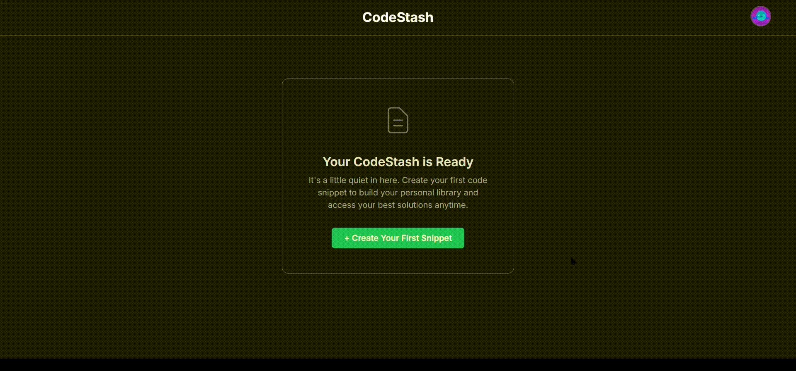
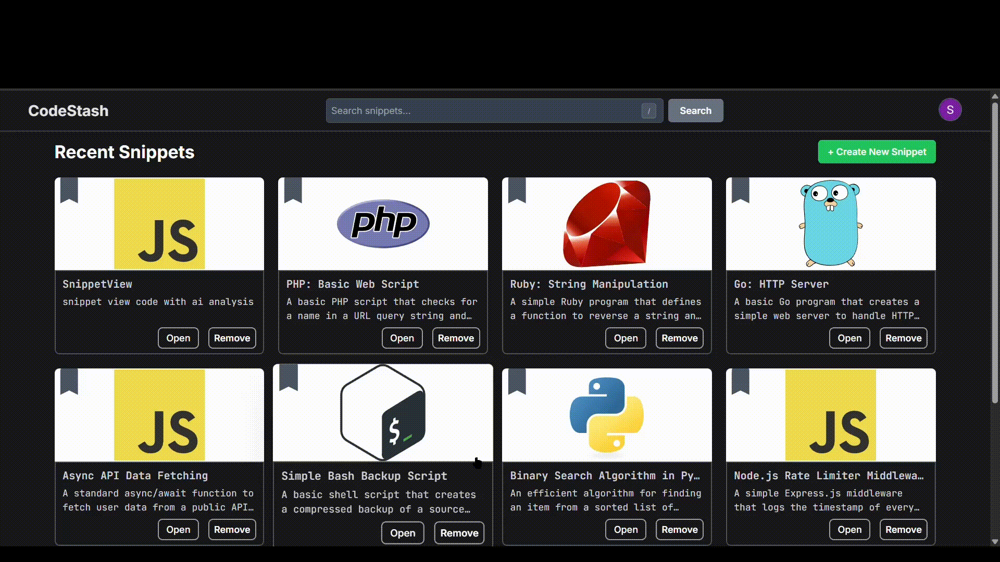

# CodeStash AI: The Intelligent Code Snippet Manager

CodeStash AI is a full-stack application designed to be an intelligent code vault for developers. It directly tackles the laborious task of writing boilerplate code by providing a centralized platform to save, find, and refine snippets. Going beyond simple storage, CodeStash AI uses ai enabled semantic search to help you find code based on its *functionality*, not just keywords. It also integrates an AI-powered review system to instantly analyze your snippets, identify potential bugs, and suggest more robust implementations.

<br>

## Live Demo

**[CodeStash]**(https://codestashin.netlify.app)

<br>

---


# Key Features in Action

## AI-Powered Semantic Search
Find snippets based on *what they do*, not just the words you use. Ask "how to make a network request in React" and find your custom hook instantly.

<div align="center">
  
</div>

## On-Demand AI Code Review
Get instant feedback on your code. Our integrated AI, powered by the Google Gemini API, identifies potential bugs, highlights security risks, and suggests improvements on demand.

<div align="center">
  
</div>

## Create, Edit, and Organize with Ease
A clean and intuitive interface for managing your code. Create new snippets, add language-specific notes with Markdown support, and edit with full syntax highlighting.

<div align="center">
  
</div>

## Pin Your Favorites
Keep your most-used snippets just a click away. Pin and unpin snippets for quick access right from your dashboard.

<div align="center">
  
</div>

---


## Tech Stack & Architecture

This project was built with a modern, scalable, and type-safe stack.

| Category                | Technology                                                                                                                                                                                             |
| ----------------------- | ------------------------------------------------------------------------------------------------------------------------------------------------------------------------------------------------------ |
| **Frontend**            | **React**, **TypeScript**, **Vite**, **Tailwind CSS**                                                                                                                                                    |
| **Backend & Database**  | **Supabase** (Authentication, Storage, PostgreSQL), **Supabase Edge Functions**                                                                                                                        |
| **AI & Vector Search**  | **Google AI (Gemini)**, **Supabase pgvector**                                                                                                                                                          |
| **Data Fetching**       | **TanStack React Query** for server state management, caching, and optimistic updates.                                                                                                                   |
| **Form Management**     | **React Hook Form** for performant and maintainable forms.                                                                                                                                             |
| **UI & UX**             | **React Icons**, **react-hot-toast** for notifications, **react-markdown**                                                                                                                             |
| **Code Highlighting**   | **react-syntax-highlighter**                                                                                                                                                                           |
| **Linting & Tooling**   | **ESLint**, **TypeScript-ESLint**, **Prettier**                                                                                                                                                        |

---

## Project Structure

The project maintains a clear separation between client-side code (`/src`), serverless functions (`/supabase`), and project configuration at the root level.

```
/
|-- /public               # Static assets
|-- /src                  # Frontend source code
|   |-- /assets
|   |-- /components       # Reusable components
|   |-- /context
|   |-- /hooks
|   |-- /pages
|   |-- /services         # API layer for fetching data
|   |-- /type             # TypeScript type definitions
|   |-- /ui               # Low-level UI primitives
|   |-- App.tsx
|   |-- main.tsx
|   +-- supabaseClient.ts # Supabase client instance
|-- /supabase
|   +-- /functions        # Serverless Edge Functions
|-- .env.local            # Environment variables
|-- index.html
|-- package.json
+-- vite.config.ts
```

---

## Getting Started with Docker (Recommended)

This is the easiest and most reliable way to run the project locally. It ensures a consistent development environment.

### Prerequisites

-   [Docker Desktop](https://www.docker.com/products/docker-desktop/) installed and running.
-   [Git](https://git-scm.com/) installed.

### Installation

1.  **Clone the repository:**
    ```sh
    git clone https://github.com/your-username/code-snippet-manager.git
    cd code-snippet-manager
    ```

2.  **Set up your environment variables:**
    Create a `.env.local` file in the root of the project. This file is securely ignored by git. You can get these values from your Supabase and Google AI project dashboards.

    ```env
    # .env.local
    VITE_SUPABASE_URL=YOUR_SUPABASE_PROJECT_URL
    VITE_SUPABASE_ANON_KEY=YOUR_SUPABASE_ANON_KEY
    GOOGLE_API_KEY=YOUR_GOOGLE_AI_API_KEY
    ```
    *Note: The Supabase functions (`/supabase/functions`) are part of this repository but are developed and deployed separately via the Supabase CLI, not managed by this Docker setup.*

3.  **Build and Run the Docker Container:**
    From the root directory, run these two commands:

    *   First, build the Docker image (a one-time process):
        ```sh
        docker build -t codestash-app .
        ```
    *   Then, run the container:
        ```sh
        docker run --rm -p 5173:5173 -v ./src:/app/src -v ./.env.local:/app/.env.local --name codestash-dev codestash-app
        ```

    Once the build is complete and the container is running, the application will be available at **`http://localhost:5173`**. The `-v ./src:/app/src` flag enables hot-reloading for development.

---

## Manual Installation

If you prefer not to use Docker, you can run the project natively on your machine.

### Prerequisites

-   Node.js (v20 or later recommended)

### Installation

1.  **Clone and install dependencies:**
    ```sh
    git clone https://github.com/your-username/code-snippet-manager.git
    cd code-snippet-manager
    npm install
    ```

2.  **Set up your environment variables:**
    Create a `.env.local` file in the root directory and add your Supabase and Google AI keys as described in the Docker setup above.

3.  **Run the development server:**
    ```sh
    npm run dev
    ```
    The application will now be running on `http://localhost:5173` (or the next available port).